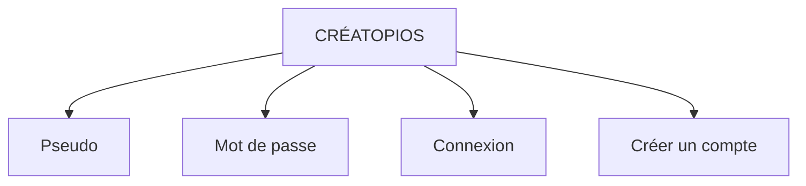
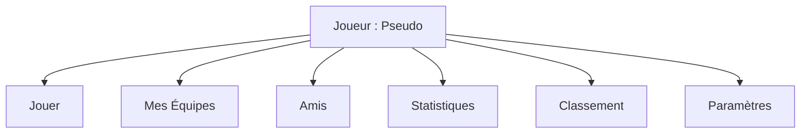
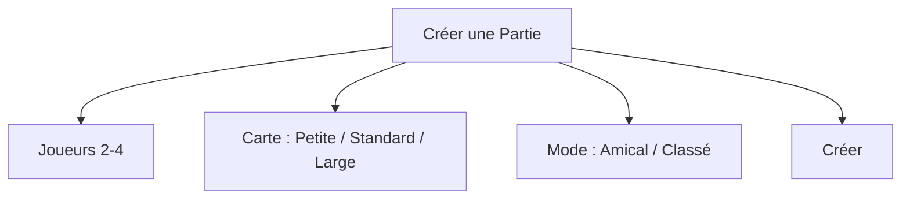
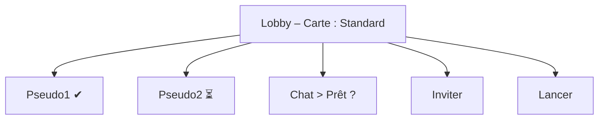

# 📕 CRÉATOPIOS

## Document de Conception Global

*(Game Design Document + Spécifications Fonctionnelles)*

---

## 0. UNIVERS & CONTEXTE NARRATIF

### 0.1 Le Monde de Créatopios

Créatopios est un monde vivant, composé de territoires élémentaires où coexistent des créatures appelées **Créatopiens**.
Chaque Créatopien est lié à une forme d’énergie naturelle : écorce, foudre, ombre, eau, vent, harmonie, etc.

Ces créatures ne sont ni bonnes ni mauvaises : elles incarnent des forces brutes de l’équilibre du monde.

### 0.2 Les Éleveurs

Les Éleveurs sont des êtres rares, capables de créer un **Lien** avec les Créatopiens.
Ce lien ne permet pas de les contrôler totalement, mais d’orchestrer leur coopération sur le champ de bataille.

Un Éleveur :

* n’intervient jamais physiquement
* n’est jamais visible
* agit uniquement par stratégie et anticipation

### 0.3 La Grande Confrontation

Depuis la disparition de l’ancien Roi des Éleveurs, l’équilibre de Créatopios s’est fragilisé.
Pour éviter l’effondrement du monde, les Éleveurs s’affrontent lors de **Confrontations de Liens**.

Ces affrontements sont des épreuves stratégiques ritualisées destinées à désigner :

* l’Éleveur dont la maîtrise des Créatopiens est la plus juste
* 🏆 Le dernier Éleveur encore capable de maintenir un Lien devient le **Gardien de l’Équilibre**

---

## 1. VISION GÉNÉRALE DU JEU

### 1.1 Concept

Créatopios est un jeu de **stratégie tactique au tour par tour**, sans hasard, jouable de 2 à 4 joueurs.
Chaque joueur incarne un Éleveur qui dirige une équipe de Créatopiens sur une carte en grille.

**Objectif :**
Être le dernier Éleveur possédant au moins un Créatopien en jeu.

### 1.2 Piliers de Design

* Zéro hasard
* Information parfaite
* Décisions irréversibles
* Synergies d’équipe
* Rythme maîtrisé (4 joueurs max)

---

## 2. RÈGLES DU JEU

### 2.1 L’Éleveur

* Pas de points de vie
* Pas d’entité sur le plateau
* Ne peut ni être ciblé, ni attaqué

**Élimination :**
Un Éleveur est éliminé dès qu’il n’a plus aucun Créatopien sur le plateau.

### 2.2 Création et Gestion des Équipes

* Maximum 8 équipes sauvegardées par Éleveur
* Une seule équipe utilisée par partie

**Budget de Recrutement :**

* Budget fixe : 10 points
* 1 à 10 Créatopiens par équipe
* Coût total ≤ 10

### 2.3 Classes de Créatopiens

| Classe               | Coût | PV | Force | Mobilité | Portée | Pouvoir                    |
| -------------------- | ---- | -- | ----- | -------- | ------ | -------------------------- |
| Garde de l’Écorce    | 3    | 15 | 2     | 2        | 1      | Régénère 1 PV              |
| Armurion             | 3    | 13 | 3     | 1        | 1      | Ignore 1 dégât / tour      |
| Archimage Végétal    | 3    | 5  | 4     | 2        | 3      | —                          |
| Lanceur d’Éclairs    | 3    | 4  | 4     | 2        | 3      | Ignore obstacles           |
| Esprit de la Cascade | 2    | 6  | 2     | 4        | 2      | Régénère 1 PV              |
| Sylphide             | 2    | 5  | 2     | 5        | 2      | Soin + déplacement 1       |
| Ombrefeu             | 2    | 6  | 3     | 6        | 2      | +1 Force après déplacement |
| Ombrelame            | 2    | 5  | 3     | 7        | 2      | Traverse 1 ennemi          |
| Lien-Tisseur         | 1    | 5  | 0     | 4        | —      | Régénère 2 PV              |
| Harmonisatrice       | 1    | 4  | 0     | 5        | —      | Régénère 1 PV à 2 alliés   |
| Voltigeur            | 1    | 4  | 1     | 8        | 1      | Attaque + déplacement 2    |
| Aérospirale          | 1    | 3  | 2     | 9        | 1      | Ignore zones de menace     |

### 2.4 Cartes et Arènes

| Taille   | Dimensions | Joueurs |
| -------- | ---------- | ------- |
| Petite   | 10 × 10    | 2       |
| Standard | 14 × 14    | 2–3     |
| Large    | 18 × 18    | 3–4     |

### 2.5 Système de Tour

* 4 Points d’Action par Éleveur
* PA non utilisés perdus
* Actions : Déplacement / Attaque / Pouvoir (1 PA)

### 2.6 Combat

* Dégâts = Force
* Portée stricte
* Créatopien éliminé à 0 PV

### 2.7 Victoire

🏆 Dernier Éleveur avec au moins un Créatopien en jeu.

---

## 3. UI / UX — SCHÉMAS DES ÉCRANS

### 3.1 Écran de Connexion



### 3.2 Menu Principal



### 3.3 Gestion des Équipes

```mermaid
flowchart TD
    A[Mes Équipes (5/8)] --> B[Équipe Tanky (10)]
    A --> C[Équipe Rush (9)]
    A --> D[Équipe Mage (10)]
    A --> E[+ Nouvelle Équipe]
```

### 3.4 Création de Partie



### 3.5 Lobby



### 3.6 Interface de Jeu

```mermaid
flowchart TD
    A[Tour : Pseudo2 PA : 3/4] --> B[CARTE (GRILLE)]
    B --> C[Sélection : Ombrefeu]
    C --> D[PV : 6/6 Mobilité : 6]
    D --> E[Déplacer]
    D --> F[Attaquer]
    D --> G[Pouvoir]
```

---

## 4. FONCTIONNALITÉS DE L’APPLICATION

### 4.1 Comptes Joueurs

* Création / connexion
* Avatar
* Statut (en ligne / en partie)

### 4.2 Amis

* Ajouter / supprimer
* Voir statut
* Inviter en partie

### 4.3 Chat

* Chat lobby
* Chat en partie
* Désactivable en classé

### 4.4 Statistiques

* Joueur : Parties jouées, Victoires, Taux de victoire, Temps moyen
* Équipes : Parties jouées, Victoires, Performances par créature

### 4.5 Classement

* Global
* Saisonnier
* Score ou Elo

---

## 5. MODÈLE DES ENTITÉS (DATA MODEL)

### 5.1 Joueur

```json
{
  "id": "player_id",
  "pseudo": "string",
  "avatar": "string",
  "teams": ["team_id"],
  "stats": {}
}
```

### 5.2 Équipe

```json
{
  "id": "team_id",
  "name": "string",
  "budget": 10,
  "creatopiens": ["creatopien_id"],
  "stats": {}
}
```

### 5.3 Créatopien

```json
{
  "id": "creatopien_id",
  "type": "Ombrefeu",
  "pv_max": 6,
  "pv_current": 6,
  "force": 3,
  "mobilite": 6,
  "portee": 2,
  "capacites": []
}
```

### 5.4 Partie

```json
{
  "id": "match_id",
  "players": ["player_id"],
  "map": {
    "width": 14,
    "height": 14
  },
  "state": "en_cours",
  "turn": "player_id"
}
```

---

## 6. POSITIONNEMENT DU JEU

Créatopios se positionne comme :

* un jeu tactique pur
* accessible mais exigeant
* orienté compétition réfléchie
* sans RNG frustrant

✅ **Conclusion**
Un univers clair, un cadre narratif fort, un jeu mécaniquement solide, prêt pour dev, pitch ou financement.
