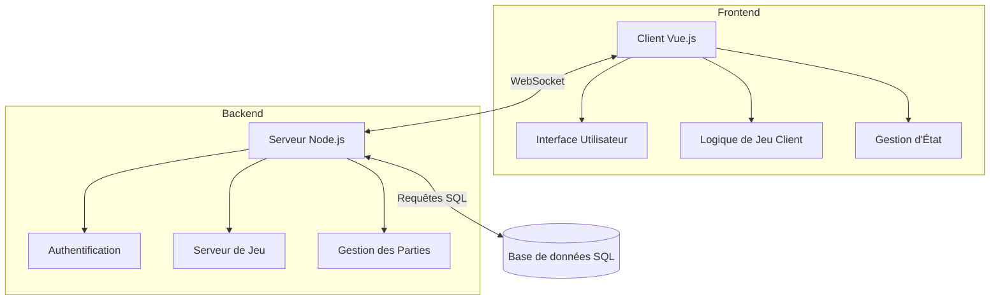
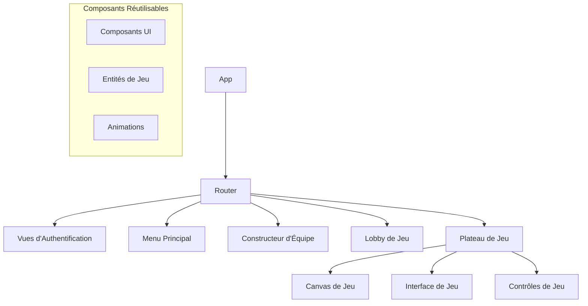
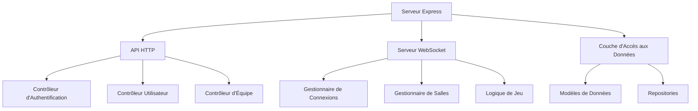
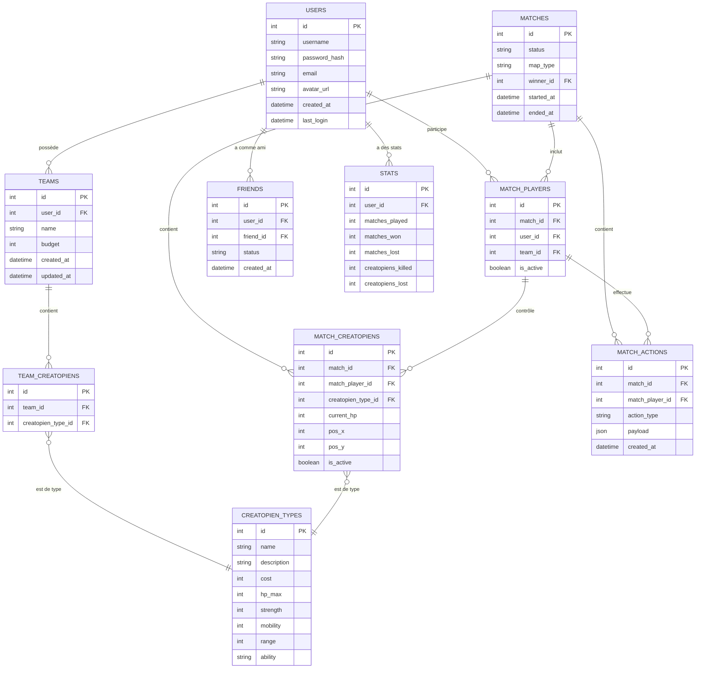

# Architecture du Jeu Créatopios

## Vue d'ensemble

Créatopios est un jeu de stratégie tactique au tour par tour, sans hasard, jouable de 2 à 4 joueurs. L'architecture proposée est conçue pour être simple et légère, tout en répondant aux besoins spécifiques du jeu.

## Architecture Globale

L'architecture du jeu Créatopios sera basée sur une structure client-serveur avec trois composants principaux :

1. **Frontend** : Application Vue.js 3 avec TypeScript
2. **Backend** : Serveur Node.js avec WebSockets
3. **Base de données** : SQL pour la persistance des données

### Diagramme d'Architecture Globale



### Flux de Communication

1. **Authentification** : Le client se connecte au serveur via HTTPS pour l'authentification
2. **Lobby et Matchmaking** : Communication via WebSockets pour la création/recherche de parties
3. **Jeu en temps réel** : Communication bidirectionnelle via WebSockets pour les actions de jeu
4. **Persistance** : Le serveur communique avec la base de données SQL pour sauvegarder/charger les données

## Architecture Frontend (Vue.js 3 + TypeScript)

L'architecture frontend sera basée sur Vue.js 3 avec TypeScript, en utilisant une approche modulaire et légère.

### Structure des Composants



### Gestion d'État

Pour garder l'architecture légère, nous utiliserons une combinaison de:

1. **Composition API de Vue 3** pour la gestion d'état locale
2. **Provide/Inject** pour partager l'état entre composants parents et enfants
3. **Store simple** pour l'état global (sans dépendance externe comme Vuex/Pinia)

```typescript
// Exemple de store simple
export const createStore = <T extends Record<string, any>>(initialState: T) => {
  const state = reactive(initialState);
  
  const getters = {};
  const actions = {};
  
  return {
    state: readonly(state),
    getters,
    actions
  };
};

// Utilisation
const gameStore = createStore({
  currentPlayer: null,
  gameState: 'waiting',
  players: [],
  map: null,
  creatopiens: []
});
```

### Modules Principaux

1. **Module d'Authentification**
   - Gestion de la connexion/inscription
   - Stockage du token JWT

2. **Module de Gestion d'Équipe**
   - Création/modification d'équipes
   - Sélection des Créatopiens

3. **Module de Jeu**
   - Rendu du plateau (Canvas)
   - Gestion des actions de jeu
   - Animation des mouvements et attaques

4. **Module de Communication**
   - Gestion des WebSockets
   - Envoi/réception des actions de jeu

### Rendu du Jeu

Le jeu sera rendu sur un canvas HTML5, avec une approche orientée objet pour les entités du jeu:

```typescript
// Exemple de classe pour les entités de jeu
abstract class GameEntity {
  protected x: number;
  protected y: number;
  protected sprite: HTMLImageElement;
  
  constructor(x: number, y: number, spritePath: string) {
    this.x = x;
    this.y = y;
    this.sprite = new Image();
    this.sprite.src = spritePath;
  }
  
  abstract render(ctx: CanvasRenderingContext2D): void;
  abstract update(deltaTime: number): void;
}

class Creatopien extends GameEntity {
  private stats: CreatopienStats;
  private state: CreatopienState;
  
  constructor(x: number, y: number, type: string, stats: CreatopienStats) {
    super(x, y, `/assets/creatopiens/${type}.png`);
    this.stats = stats;
    this.state = 'idle';
  }
  
  render(ctx: CanvasRenderingContext2D): void {
    // Logique de rendu
    ctx.drawImage(this.sprite, this.x, this.y);
    
    // Affichage des PV
    ctx.fillText(`${this.stats.pv_current}/${this.stats.pv_max}`, this.x, this.y - 10);
  }
  
  update(deltaTime: number): void {
    // Logique de mise à jour
    if (this.state === 'moving') {
      // Animation de déplacement
    }
  }
}
```

### Gestion des Interactions

Les interactions utilisateur seront gérées via des gestionnaires d'événements sur le canvas:

```typescript
// Exemple de gestionnaire d'événements
canvas.addEventListener('click', (event) => {
  const { offsetX, offsetY } = event;
  const gridX = Math.floor(offsetX / CELL_SIZE);
  const gridY = Math.floor(offsetY / CELL_SIZE);
  
  // Logique de sélection/action
  gameController.handleCellClick(gridX, gridY);
});
```

### Optimisations

1. **Lazy Loading** des composants pour réduire la taille initiale du bundle
2. **Mise en cache** des assets (sprites, sons)
3. **Rendu conditionnel** pour n'afficher que les éléments visibles

## Architecture Backend (Node.js + WebSockets)

L'architecture backend sera basée sur Node.js avec WebSockets pour la communication en temps réel, et une base de données SQL pour la persistance.

### Structure du Serveur



### Modules Principaux

1. **Module d'Authentification**
   - Inscription/Connexion des utilisateurs
   - Gestion des JWT
   - Middleware d'authentification

2. **Module de Gestion des WebSockets**
   - Gestion des connexions
   - Gestion des salles de jeu
   - Diffusion des événements

3. **Module de Logique de Jeu**
   - Validation des actions
   - Application des règles du jeu
   - Calcul des états de jeu

4. **Module d'Accès aux Données**
   - Interaction avec la base de données
   - Modèles et repositories

### Gestion des WebSockets

Nous utiliserons la bibliothèque `ws` ou `socket.io` pour implémenter les WebSockets:

```typescript
// Exemple avec socket.io
import { Server } from 'socket.io';

const io = new Server(httpServer);

// Gestion des connexions
io.on('connection', (socket) => {
  console.log('Nouveau client connecté');
  
  // Authentification du socket
  socket.on('authenticate', (token) => {
    const user = verifyToken(token);
    if (user) {
      socket.data.user = user;
      socket.emit('authenticated', { success: true });
    } else {
      socket.emit('authenticated', { success: false });
    }
  });
  
  // Rejoindre une salle
  socket.on('join_room', (roomId) => {
    socket.join(roomId);
    const room = gameRoomManager.getRoom(roomId);
    if (room) {
      socket.emit('room_joined', room.getState());
      io.to(roomId).emit('player_joined', socket.data.user);
    }
  });
  
  // Action de jeu
  socket.on('game_action', (action) => {
    const { roomId, actionType, payload } = action;
    const room = gameRoomManager.getRoom(roomId);
    
    if (room && room.isPlayerTurn(socket.data.user.id)) {
      const result = gameLogic.processAction(room, actionType, payload);
      
      if (result.success) {
        // Diffuser le nouvel état à tous les joueurs de la salle
        io.to(roomId).emit('game_state_update', room.getState());
      } else {
        // Informer le joueur de l'échec de l'action
        socket.emit('action_failed', result.error);
      }
    }
  });
  
  // Déconnexion
  socket.on('disconnect', () => {
    // Gérer la déconnexion
    gameRoomManager.handlePlayerDisconnect(socket.data.user?.id);
  });
});
```

### Logique de Jeu

La logique de jeu sera implémentée côté serveur pour garantir l'intégrité des règles:

```typescript
class GameLogic {
  processAction(room: GameRoom, actionType: string, payload: any): ActionResult {
    const game = room.getGame();
    const player = room.getPlayerById(payload.playerId);
    
    switch (actionType) {
      case 'move':
        return this.processMove(game, player, payload);
      case 'attack':
        return this.processAttack(game, player, payload);
      case 'use_ability':
        return this.processAbility(game, player, payload);
      default:
        return { success: false, error: 'Action non reconnue' };
    }
  }
  
  private processMove(game: Game, player: Player, payload: MovePayload): ActionResult {
    const { creatopienId, targetX, targetY } = payload;
    const creatopien = game.getCreatopienById(creatopienId);
    
    // Vérifier que le créatopien appartient au joueur
    if (creatopien.playerId !== player.id) {
      return { success: false, error: 'Ce créatopien ne vous appartient pas' };
    }
    
    // Vérifier que le déplacement est valide
    if (!this.isValidMove(game, creatopien, targetX, targetY)) {
      return { success: false, error: 'Déplacement invalide' };
    }
    
    // Appliquer le déplacement
    game.moveCreatopien(creatopienId, targetX, targetY);
    
    return { success: true };
  }
  
  // Autres méthodes pour gérer les différentes actions...
}
```

### Sécurité

1. **Authentification** via JWT
2. **Validation des actions** côté serveur
3. **Rate limiting** pour prévenir les abus
4. **Validation des données** entrantes

### Scalabilité

Pour une première version, un serveur unique sera suffisant. Pour une mise à l'échelle future:

1. **Architecture en microservices**
   - Service d'authentification
   - Service de matchmaking
   - Service de jeu
   - Service de statistiques

2. **Mise en cache** avec Redis pour les données fréquemment accédées
3. **Load balancing** pour répartir la charge entre plusieurs instances

## Modèle de Données SQL

Le modèle de données sera implémenté dans une base de données SQL (MySQL, PostgreSQL ou SQLite pour le développement).

### Schéma de Base de Données



### Description des Tables

1. **USERS**
   - Stocke les informations des utilisateurs
   - Authentification et profil

2. **TEAMS**
   - Équipes créées par les utilisateurs
   - Budget et métadonnées

3. **CREATOPIEN_TYPES**
   - Catalogue des types de Créatopiens
   - Statistiques de base et capacités

4. **TEAM_CREATOPIENS**
   - Association entre équipes et types de Créatopiens
   - Composition des équipes

5. **MATCHES**
   - Informations sur les parties
   - État, carte, vainqueur

6. **MATCH_PLAYERS**
   - Joueurs participant à une partie
   - Équipe utilisée

7. **MATCH_CREATOPIENS**
   - Instances de Créatopiens dans une partie
   - Position, PV actuels, état

8. **MATCH_ACTIONS**
   - Journal des actions effectuées
   - Historique pour replay/analyse

9. **FRIENDS**
   - Relations d'amitié entre utilisateurs
   - Statut (en attente, accepté)

10. **STATS**
    - Statistiques des joueurs
    - Performances globales

### Requêtes SQL Typiques

```sql
-- Récupérer les équipes d'un utilisateur
SELECT t.* FROM TEAMS t WHERE t.user_id = ?;

-- Récupérer la composition d'une équipe
SELECT ct.* FROM TEAM_CREATOPIENS tc
JOIN CREATOPIEN_TYPES ct ON tc.creatopien_type_id = ct.id
WHERE tc.team_id = ?;

-- Récupérer l'état d'une partie en cours
SELECT m.*, mp.*, mc.*
FROM MATCHES m
JOIN MATCH_PLAYERS mp ON m.id = mp.match_id
JOIN MATCH_CREATOPIENS mc ON mp.id = mc.match_player_id
WHERE m.id = ? AND m.status = 'in_progress';

-- Récupérer les statistiques d'un joueur
SELECT s.* FROM STATS s WHERE s.user_id = ?;
```

## Structure des Fichiers et Dossiers

### Structure Frontend

```
frontend/
├── public/
│   ├── assets/
│   │   ├── creatopiens/
│   │   ├── maps/
│   │   └── ui/
│   ├── favicon.ico
│   └── index.html
├── src/
│   ├── assets/
│   │   └── styles/
│   ├── components/
│   │   ├── auth/
│   │   ├── common/
│   │   ├── game/
│   │   │   ├── board/
│   │   │   ├── controls/
│   │   │   └── entities/
│   │   ├── lobby/
│   │   └── team-builder/
│   ├── composables/
│   │   ├── useAuth.ts
│   │   ├── useGame.ts
│   │   ├── useSocket.ts
│   │   └── useTeam.ts
│   ├── config/
│   │   ├── constants.ts
│   │   └── game-config.ts
│   ├── models/
│   │   ├── creatopien.ts
│   │   ├── game.ts
│   │   ├── player.ts
│   │   └── team.ts
│   ├── router/
│   │   └── index.ts
│   ├── services/
│   │   ├── api.service.ts
│   │   ├── auth.service.ts
│   │   ├── game.service.ts
│   │   └── socket.service.ts
│   ├── store/
│   │   ├── auth.store.ts
│   │   ├── game.store.ts
│   │   └── index.ts
│   ├── utils/
│   │   ├── canvas.utils.ts
│   │   └── validation.utils.ts
│   ├── views/
│   │   ├── AuthView.vue
│   │   ├── GameView.vue
│   │   ├── HomeView.vue
│   │   ├── LobbyView.vue
│   │   ├── ProfileView.vue
│   │   └── TeamBuilderView.vue
│   ├── App.vue
│   ├── main.ts
│   ├── shims-vue.d.ts
│   └── vite-env.d.ts
├── .eslintrc.js
├── .gitignore
├── index.html
├── package.json
├── tsconfig.json
└── vite.config.ts
```

### Structure Backend

```
backend/
├── src/
│   ├── config/
│   │   ├── database.ts
│   │   ├── server.ts
│   │   └── socket.ts
│   ├── controllers/
│   │   ├── auth.controller.ts
│   │   ├── team.controller.ts
│   │   └── user.controller.ts
│   ├── game/
│   │   ├── actions/
│   │   ├── entities/
│   │   ├── logic/
│   │   └── state/
│   ├── middleware/
│   │   ├── auth.middleware.ts
│   │   ├── error.middleware.ts
│   │   └── validation.middleware.ts
│   ├── models/
│   │   ├── creatopien.model.ts
│   │   ├── match.model.ts
│   │   ├── team.model.ts
│   │   └── user.model.ts
│   ├── repositories/
│   │   ├── creatopien.repository.ts
│   │   ├── match.repository.ts
│   │   ├── team.repository.ts
│   │   └── user.repository.ts
│   ├── routes/
│   │   ├── auth.routes.ts
│   │   ├── index.ts
│   │   ├── team.routes.ts
│   │   └── user.routes.ts
│   ├── services/
│   │   ├── auth.service.ts
│   │   ├── game.service.ts
│   │   ├── socket.service.ts
│   │   └── team.service.ts
│   ├── socket/
│   │   ├── handlers/
│   │   ├── rooms.ts
│   │   └── socket-server.ts
│   ├── types/
│   │   ├── game.types.ts
│   │   └── socket.types.ts
│   ├── utils/
│   │   ├── auth.utils.ts
│   │   ├── game.utils.ts
│   │   └── validation.utils.ts
│   ├── app.ts
│   └── server.ts
├── .env
├── .eslintrc.js
├── .gitignore
├── package.json
├── tsconfig.json
└── nodemon.json
```

### Structure Base de Données

```
database/
├── migrations/
│   ├── 001_create_users_table.sql
│   ├── 002_create_teams_table.sql
│   ├── 003_create_creatopien_types_table.sql
│   └── ...
├── seeds/
│   ├── creatopien_types.sql
│   └── test_users.sql
└── schema.sql
```

## Conclusion

Cette architecture propose une solution complète pour le jeu Créatopios, avec:

1. **Frontend Vue.js 3 + TypeScript** pour une interface utilisateur réactive et typée
2. **Backend Node.js avec WebSockets** pour une communication en temps réel
3. **Base de données SQL** pour la persistance des données
4. **Structure modulaire** pour faciliter la maintenance et l'évolution

L'architecture est conçue pour être simple et légère, tout en offrant les fonctionnalités nécessaires pour un jeu de stratégie au tour par tour multijoueur.

Les prochaines étapes pourraient inclure:

1. **Prototypage** des composants clés
2. **Mise en place** de l'infrastructure de base
3. **Développement itératif** des fonctionnalités
